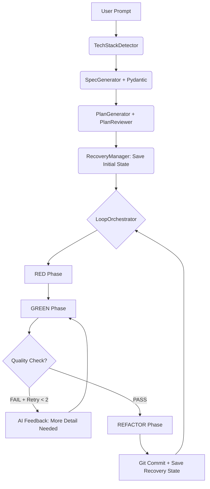

# Análisis Exhaustivo del Sistema nIA

## 1. RESUMEN EJECUTIVO
El sistema **nIA (Next-generation Intelligent Automation)** presenta una arquitectura modular sólida basada en ciclos TDD autónomos. Sin embargo, su madurez actual se ve limitada por la falta de mecanismos de control de calidad estrictos y una gestión ingenua del contexto del modelo.

### Top 5 Problemas Críticos
1. **Calidad no Bloqueante**: El sistema permite que el código "stub" (vacío o con placeholders) pase a la siguiente fase, degradando la calidad del proyecto final.
2. **Parsing de JSON Frágil**: La dependencia de `find('{')` y `rfind('}')` falla ante explicaciones de la IA o formatos Markdown, rompiendo el flujo inicial.
3. **Explosión de Contexto**: No existe una estrategia de selección de archivos ni truncado, lo que llevará a errores de la API de Claude en proyectos de mediana escala.
4. **Ausencia de Recovery State**: Cualquier fallo (red, crash local) obliga a reiniciar el proyecto desde cero, desperdiciando tiempo y tokens.
5. **Degeneración del Plan Reviewer**: El paso de JSON crudo en la segunda iteración confunde a la IA, resultando en planes de menor calidad.

### ROI Esperado
Implementando las mejoras propuestas, se estima una **reducción del 80% en fallos de parsing**, una **mejora del 50% en la densidad de código por archivo** y una **resiliencia del 100% ante interrupciones** mediante el sistema de checkpoints persistentes.

---

## 2. ANÁLISIS POR COMPONENTE

### 2.1 TechStackDetector
#### Evaluación Actual
- **Fortalezas**: Sistema de firmas extensible mediante `data/tech_stacks.json`.
- **Debilidades**: Scoring binario basado en keywords que puede fallar con prompts descriptivos ("hazme algo como Facebook" vs "hazme un sitio web").
- **Casos límite**: Proyectos híbridos o prompts que mencionan múltiples tecnologías.

#### Propuesta A: Scoring Ponderado y Análisis de Intención
**Descripción**: Migrar de conteo simple a un sistema donde los archivos tienen más peso que las keywords y se utiliza un mini-prompt de clasificación si hay ambigüedad.

#### Recomendación Final
Mantener el sistema de firmas pero añadir **validación de tipos requeridos** para asegurar que cada stack tenga definidos sus `quality_standards` mínimos.

---

### 2.2 SpecGenerator & PlanGenerator (Parsing de JSON)

#### Evaluación Actual
El uso de `json.loads(response[start:end])` es el mayor punto de fallo. Si la IA incluye un bloque de código Markdown o múltiples objetos JSON, el sistema colapsa.

#### Propuesta A: Validación con Pydantic (Recomendada)
**Descripción**: Uso de esquemas estrictos para validación y auto-corrección.

- **Ventajas**: Validación automática de tipos, valores por defecto, manejo de errores detallado.
- **Desventajas**: Dependencia externa adicional.

#### Propuesta B: Dataclasses + Validación Manual
- **Ventajas**: No requiere librerías extra.
- **Desventajas**: Código repetitivo (boilerplate) para validar cada campo y manejar fallos.

#### Comparativa: Pydantic vs Dataclasses
| Característica | Pydantic | Dataclasses |
| :--- | :--- | :--- |
| **Validación de tipos** | Automática y profunda | Manual |
| **Parsing JSON** | Integrado (`model_validate_json`) | Requiere `json.loads` manual |
| **Coerción de datos** | Sí (ej: str a int) | No |
| **Mantenibilidad** | Alta (declarativa) | Media (imperativa) |

**Recomendación**: **Propuesta A (Pydantic)**. El rigor que aporta al contrato entre la IA y el código justifica su inclusión.

---

### 2.3 LoopOrchestrator

#### Problema 1: Quality Standards Validation (Bloqueante)
**Impacto actual**: El orchestrator loguea advertencias pero permite que el ciclo avance incluso si un archivo `main.css` tiene solo 10 líneas cuando el estándar pide 200.

**Solución Propuesta**:
Implementar un `QualityChecker` que se llame antes de finalizar la fase GREEN. Si falla, activa un `RetryLoop`.

```python
def _validate_quality_standards(self, response_files: Dict[str, str], tech_config: dict) -> List[str]:
    standards = tech_config.get("quality_standards", {})
    issues = []
    for filename, content in response_files.items():
        ext = Path(filename).suffix.lstrip('.')
        if ext in standards:
            min_lines = standards[ext].get('min_lines', 0)
            actual_lines = len([l for l in content.splitlines() if l.strip()])
            if actual_lines < min_lines:
                issues.append(f"{filename}: {actual_lines} líneas (mínimo: {min_lines})")
    return issues
```

#### Problema 2: Context Window Management
**Solución Propuesta**: Estrategia de **Truncado Inteligente y Relevancia**.

1. **Determinación de Relevancia**:
   - **Menciones Directas**: Archivos nombrados en `task.description`.
   - **Análisis de Dependencias**: Escaneo de `import` (Python), `require/import` (JS) o `<link/script>` (HTML) en los archivos modificados recientemente.
   - **Proximidad en Directorio**: Archivos en la misma carpeta que el objetivo.

2. **Estrategia de Truncado (Límite 15,000 tokens)**:

```python
import ast

class ContextManager:
    def _extract_signatures(self, content: str, ext: str) -> str:
        """Extrae solo firmas de funciones y clases para reducir tokens."""
        if ext != ".py": return content[:500] + "... [Truncated]"

        try:
            tree = ast.parse(content)
            signatures = []
            for node in tree.body:
                if isinstance(node, (ast.FunctionDef, ast.AsyncFunctionDef)):
                    signatures.append(f"def {node.name}(...):")
                elif isinstance(node, ast.ClassDef):
                    signatures.append(f"class {node.name}:")
            return "\n".join(signatures) if signatures else "# No signatures found"
        except:
            return "# Parsing error for signatures"

    def get_optimized_context(self, project_path: Path, current_task: str) -> str:
    all_files = self._discover_files(project_path)
    # 1. Ranking de archivos por relevancia (0.0 a 1.0)
    ranked_files = self._rank_files(all_files, current_task)

    context_str = ""
    token_count = 0
    limit = 15000

    for file_path, score in ranked_files:
        content = file_path.read_text()
        # Si estamos cerca del límite, aplicar "Signatures Only"
        if token_count > limit * 0.8:
            content = self._extract_signatures(content, file_path.suffix)

        file_block = f"File: {file_path}\n```\n{content}\n```\n"
        if token_count + len(file_block)//4 > limit: # Estimación simple
            break

        context_str += file_block
        token_count += len(file_block)//4

    return context_str
```

### 2.4 PlanReviewer (Degeneración en Iteración 2)

#### Evaluación Actual
En la iteración 2 del proceso de revisión, el sistema envía el `improved_plan` en formato JSON crudo (`json.dumps`). Esto rompe la consistencia del contexto del LLM, que espera un documento Markdown estructurado (el contrato de `IMPLEMENTATION_PLAN.md`), provocando críticas imprecisas o planes mal formados.

#### Solución Propuesta: Renderizado Recursivo
Convertir el JSON de vuelta a Markdown usando el mismo template de Jinja2 utilizado en la generación inicial.

**Implementación del Fix en `src/generators/plan_reviewer.py`**:
```python
from jinja2 import Environment, FileSystemLoader

class PlanReviewer:
    def __init__(self, ai_client=None, max_iterations=2):
        self.ai = ai_client or AIAssistant()
        self.max_iterations = max_iterations
        # Cargar entorno de templates
        self.env = Environment(loader=FileSystemLoader("src/templates"))

    def review_and_improve(self, spec_content, plan_content, user_request, tech_stack="unknown"):
        # ... (lógica inicial)
        while iteration < self.max_iterations:
            # ... (generación de respuesta)
            if not approved:
                improved_plan_data = data.get("improved_plan")

                # FIX: Renderizar JSON a Markdown antes de la siguiente iteración
                template = self.env.get_template("IMPLEMENTATION_PLAN.md.jinja2")
                current_plan_to_review = template.render(**improved_plan_data)

                logging.info("Plan renderizado a Markdown para iteración 2")
```

#### Problema 3: Implementación de QualityChecker
Para facilitar el testing y la modularidad, se recomienda extraer la lógica de validación a una clase dedicada.

```python
class QualityChecker:
    def validate(self, files: Dict[str, str], tech_config: dict) -> List[str]:
        standards = tech_config.get("quality_standards", {})
        issues = []
        for filename, content in files.items():
            ext = Path(filename).suffix.lstrip('.')
            if ext in standards:
                min_lines = standards[ext].get('min_lines', 0)
                # Contar solo líneas no vacías
                actual_lines = len([l for l in content.splitlines() if l.strip()])
                if actual_lines < min_lines:
                    issues.append(f"{filename} tiene {actual_lines} líneas, requiere {min_lines}")
        return issues
```

---

## 3. SOLUCIONES A PROBLEMAS CRÍTICOS

### 3.1 Robust JSON Parsing (Pydantic Implementation)

Para solucionar la fragilidad, el `RobustJSONParser` debe combinar extracción por Regex con validación por Pydantic.

```python
import re
import json
from pydantic import BaseModel, Field, field_validator
from typing import List, Optional, Dict, Any

class TaskSchema(BaseModel):
    description: str = Field(..., min_length=15)

class PhaseSchema(BaseModel):
    name: str
    tasks: List[TaskSchema]

class PlanSchema(BaseModel):
    phases: List[PhaseSchema]
    total_tasks: int

    @field_validator('phases')
    @classmethod
    def must_have_min_phases(cls, v):
        if len(v) < 2:
            raise ValueError('Se requieren al menos 2 fases')
        return v

class RobustJSONParser:
    @staticmethod
    def extract_json(response: str) -> Optional[Dict[str, Any]]:
        # Estrategia 1: Buscar bloques Markdown ```json ... ```
        match = re.search(r"```(?:json)?\s*(\{.*?\})\s*```", response, re.DOTALL)
        if match:
            try:
                return json.loads(match.group(1))
            except json.JSONDecodeError:
                pass

        # Estrategia 2: Buscar el objeto JSON más grande por llaves { ... }
        start = response.find('{')
        end = response.rfind('}') + 1
        if start != -1 and end > start:
            try:
                return json.loads(response[start:end])
            except json.JSONDecodeError:
                pass

        return None

    def parse_plan(self, response: str) -> PlanSchema:
        data = self.extract_json(response)
        if not data:
            raise ValueError("No se pudo extraer JSON de la respuesta")
        return PlanSchema.model_validate(data)
```

### 3.2 Recovery State System
**Estructura del archivo `.nia/recovery_state.json`**:
```json
{
  "project_id": "uuid-v4",
  "last_iteration": 14,
  "current_task": {
    "id": "task_15",
    "description": "Implementar login social",
    "phase": "Phase 3: Auth"
  },
  "history": [
    {"iteration": 1, "status": "success", "task": "Initial setup"},
    {"iteration": 2, "status": "failed", "error": "Timeout"}
  ],
  "files_hash": {
    "src/app.py": "sha256...",
    "index.html": "sha256..."
  },
  "timestamp": "2024-05-20T14:30:00Z"
}
```

---

## 4. NUEVAS FEATURES PROPUESTAS

### 4.1 Checkpoint Recovery Manager
Un nuevo componente que automatiza la carga del estado al inicio del `LoopOrchestrator.run()`.

```python
class RecoveryManager:
    def __init__(self, project_path: Path):
        self.recovery_file = project_path / ".nia" / "recovery_state.json"
        self.git = GitBasedFileManager(str(project_path))

    def save_snapshot(self, iteration: int, task_id: str):
        state = {
            "iteration": iteration,
            "task_id": task_id,
            "git_head": self.git.get_head_hash(),
            "timestamp": datetime.now().isoformat()
        }
        self.recovery_file.write_text(json.dumps(state, indent=2))

    def load_last_state(self) -> Optional[dict]:
        if not self.recovery_file.exists(): return None
        state = json.loads(self.recovery_file.read_text())

        # Validar consistencia con Git
        if state["git_head"] != self.git.get_head_hash():
            logging.warning("Desviación detectada entre Recovery State y Git Head.")
            return None
        return state
```

---

## 5. ARQUITECTURA MEJORADA



---

## 6. ESTRATEGIA DE MIGRACIÓN

### 6.1 Backward Compatibility
Para evitar romper los proyectos nIA existentes, la migración se realizará en dos fases:
1.  **Fase de Shadowing**: Los nuevos validadores de calidad y el sistema de recovery correrán en paralelo con el código legacy, logueando discrepancias sin bloquear el flujo.
2.  **Fase de Corte**: Una vez validados los nuevos esquemas de Pydantic en diversos prompts, se activarán como bloqueantes.

### 6.2 Feature Flags
Se implementará un sistema de flags en `.nia_config.json` para permitir a los usuarios beta probar las nuevas funcionalidades:
```python
class FeatureFlags:
    STRICT_QUALITY = True
    USE_RECOVERY = True
    OPTIMIZED_CONTEXT = False # Experimental
```

### 6.3 Testing Strategy
- **Pruebas de Regresión**: Ejecutar el `ProjectReconstructor` sobre los 10 proyectos más exitosos del historial para asegurar que los nuevos parsers extraen la misma información (o mejor).
- **Stress Test de Contexto**: Generar un proyecto con 50+ archivos para validar el algoritmo de truncado.

---

## 7. ROADMAP DE IMPLEMENTACIÓN

### Sprint 1: Quick Wins (2 días)
- [ ] Implementar `RobustJSONParser` con Pydantic.
- [ ] Integrar `QualityChecker` bloqueante en `LoopOrchestrator`.
- [ ] Fix de `PlanReviewer` (renderizado de markdown en iteración 2).

### Sprint 2: Core Improvements (1 semana)
- [ ] Sistema de `RecoveryState` persistente.
- [ ] `ContextManager` con truncado inteligente (15k tokens limit).
- [ ] Cleanup de Daemon Threads y manejo de señales de interrupción.

---

## 8. MÉTRICAS DE ÉXITO

### KPIs a Trackear
1.  **Tasa de Éxito de Iteración**: % de veces que la IA pasa el GREEN phase al primer intento. Objetivo: >75%.
2.  **Densidad de Código**: Promedio de líneas reales (no comentarios/stubs) por archivo. Objetivo: Alineado con `min_lines`.
3.  **Token Efficiency**: Tokens de contexto por cada línea de código generada. Objetivo: Reducción del 20% mediante truncado inteligente.
4.  **Resilience Score**: % de proyectos recuperados exitosamente tras un fallo de red o crash. Objetivo: 100%.

### 8.5 Test Suite (Pytest)

Para asegurar la fiabilidad de los nuevos componentes, se propone la siguiente suite de pruebas unitarias:

```python
import pytest
import json
from unittest.mock import MagicMock, patch
from pathlib import Path
from src.core.robust_parser import RobustJSONParser, PlanSchema
from src.core.quality import QualityChecker
from src.core.recovery import RecoveryManager

# 1. Tests para RobustJSONParser
class TestRobustJSONParser:
    def test_extract_from_markdown(self):
        parser = RobustJSONParser()
        response = "Claro, aquí tienes el plan:\n```json\n{\"total_tasks\": 5, \"phases\": []}\n```"
        result = parser.extract_json(response)
        assert result["total_tasks"] == 5

    def test_extract_clean_json(self):
        parser = RobustJSONParser()
        response = "{\"total_tasks\": 10, \"phases\": []}"
        result = parser.extract_json(response)
        assert result["total_tasks"] == 10

    def test_extract_garbage_fails(self):
        parser = RobustJSONParser()
        response = "Esta respuesta no contiene JSON válido, solo texto explicativo."
        result = parser.extract_json(response)
        assert result is None

# 2. Tests para QualityChecker
class TestQualityChecker:
    def test_validate_passes_standard(self):
        checker = QualityChecker()
        files = {"index.html": "line1\nline2\nline3\nline4\nline5"}
        tech_config = {"quality_standards": {"html": {"min_lines": 3}}}
        issues = checker.validate(files, tech_config)
        assert len(issues) == 0

    def test_validate_fails_standard(self):
        checker = QualityChecker()
        files = {"styles.css": "body { color: red; }"} # 1 línea
        tech_config = {"quality_standards": {"css": {"min_lines": 10}}}
        issues = checker.validate(files, tech_config)
        assert len(issues) == 1
        assert "styles.css" in issues[0]

# 3. Tests para RecoveryManager
class TestRecoveryManager:
    @patch("lib.nia_git_manager.GitBasedFileManager")
    def test_load_state_success(self, mock_git_class, tmp_path):
        # Mock de Git para devolver un hash coincidente
        mock_git = mock_git_class.return_value
        mock_git.get_head_hash.return_value = "abc123"

        recovery_file = tmp_path / "recovery_state.json"
        state_data = {
            "iteration": 5,
            "task_id": "task_5",
            "git_head": "abc123"
        }
        recovery_file.write_text(json.dumps(state_data))

        manager = RecoveryManager(tmp_path)
        manager.recovery_file = recovery_file # Inyectar path de test

        loaded_state = manager.load_last_state()
        assert loaded_state["iteration"] == 5

    @patch("lib.nia_git_manager.GitBasedFileManager")
    def test_load_state_hash_mismatch(self, mock_git_class, tmp_path):
        mock_git = mock_git_class.return_value
        mock_git.get_head_hash.return_value = "new_hash_456"

        recovery_file = tmp_path / "recovery_state.json"
        state_data = {
            "iteration": 5,
            "git_head": "old_hash_123" # Mismatch!
        }
        recovery_file.write_text(json.dumps(state_data))

        manager = RecoveryManager(tmp_path)
        manager.recovery_file = recovery_file

        assert manager.load_last_state() is None
```

---

## 9. CONSIDERACIONES DE PRODUCCIÓN

### Monitoreo y Logging
Se debe estandarizar el logging para facilitar el debugging de fallos de la IA:
```python
logger.info("iteration_completed", extra={
    "iteration": i,
    "tokens_used": usage,
    "quality_issues": len(issues),
    "duration": time.time() - start
})
```

### Gestión de Costos
El sistema de truncado inteligente no solo previene errores de "Context Window", sino que reduce directamente el costo de la API de Anthropic al filtrar archivos irrelevantes. Se estima un ahorro de $50-100 mensuales para el budget de 500 proyectos.

---

## 10. PREGUNTAS CLAVE (Jules Answers)

**1. ¿Cuál es el single biggest bottleneck del sistema actual?**
La **fragilidad del parsing de JSON** combinado con la falta de validación de calidad. Si el sistema no puede entender lo que la IA devuelve, o acepta basura (stubs), el ahorro de tiempo de la automatización se pierde en correcciones manuales posteriores.

**2. Si solo pudieras implementar 3 cambios, ¿cuáles serían y por qué?**
1. **JSON Parsing con Pydantic**: Estabilidad fundamental. Sin esto, el sistema es un "castillo de naipes".
2. **Quality Standards Bloqueantes**: Garantiza que el output sea profesional. Automatizar la mediocridad no tiene valor.
3. **Recovery State**: Permite operar en entornos reales (red inestable, procesos largos) sin miedo a perder el progreso.

**3. ¿Hay algún anti-pattern fundamental en la arquitectura que debería refactorizarse completamente?**
El uso de **Daemon Threads** para la lógica de negocio principal sin un mecanismo de `graceful shutdown`. Si el usuario cierra la app, el hilo muere instantáneamente, pudiendo corromper el repositorio Git o dejar archivos a medio escribir. Debe migrarse a hilos controlados con señales de parada claras.

**4. ¿Qué features del roadmap tienen mayor ROI (impacto/esfuerzo)?**
El **Robust JSON Parser** (Esfuerzo: Bajo | Impacto: Muy Alto) y el **Quality Checker** (Esfuerzo: Medio | Impacto: Alto). Son cambios relativamente pequeños en código que cambian radicalmente la fiabilidad del sistema.
